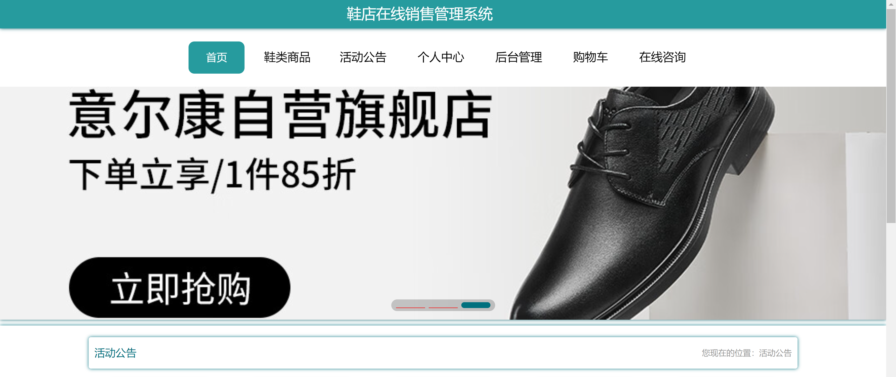
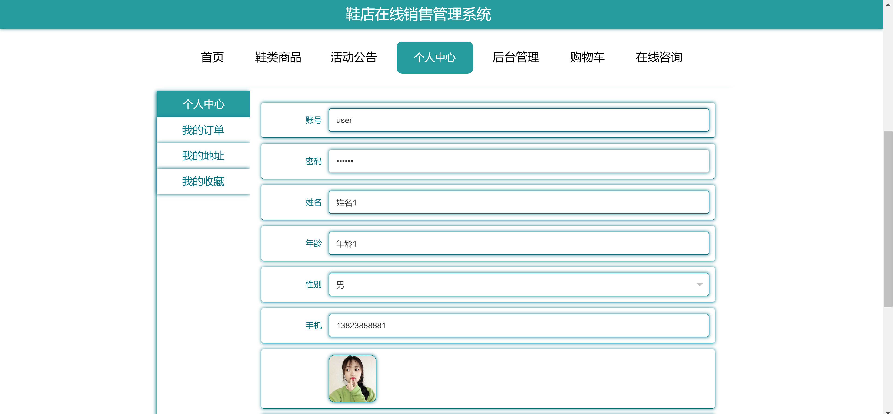
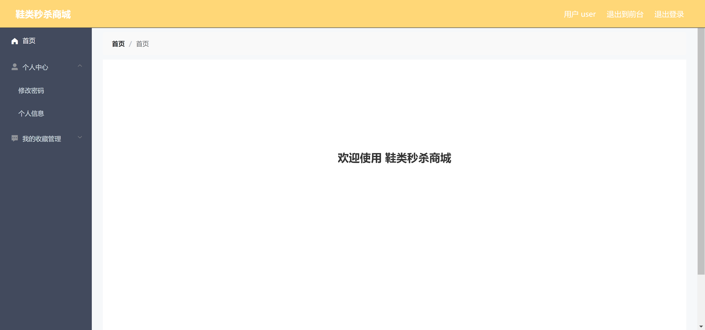
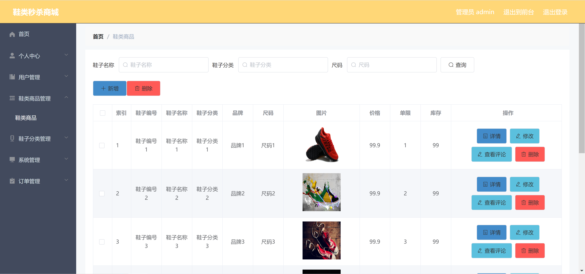
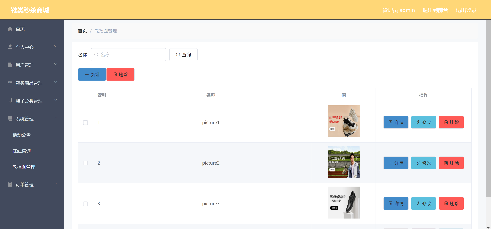

<h1 align="center">鞋店在线销售管理系统</h1>

## 简介
鞋店在线销售管理系统：系统角色分为管理员和用户；功能包括用户管理、鞋类商品管理、订单管理、轮播图管理及在线咨询。界面设计简洁，提高用户购物与管理体验。    --计算机毕业设计源码；毕设源码；java毕业设计源码

## 联系方式

<h3 align="center">获取完整代码与数据库文件 + 微信：bysj5151 QQ: 86050149 QQ群: 783742310</h3>

<h3 align="center">可帮忙远程部署 包运行成功！提供远程部署、修改代码、设计文档指导、代码讲解等服务！</h3>

## 功能介绍（完整见运行截图）
管理员：基本功能包括管理员登录、注册和退出系统。系统管理界面涵盖用户管理、鞋类商品管理、鞋子分类管理、系统管理、以及活动公告管理等，多种管理操作可供选择，例如商品的新增、删除、修改和查看详细信息。同时支持对轮播图的管理及筛选查看，在订单管理模块中可查看和编辑订单信息。
用户：用户可以通过登录界面进入系统，通过主导航栏访问首页、鞋类商品和活动公告等功能区域。个人中心提供了用户信息的展示和编辑，支持修改个人资料及密码，查看订单、地址和收藏。购物过程中，用户可以浏览商品信息，添加商品到购物车，进行模拟在线支付，并通过商品界面搜索、查看评论，或通过广告促销直接下单购买。

## 运行截图

本代码来源于网络,仅供学习参考使用!

